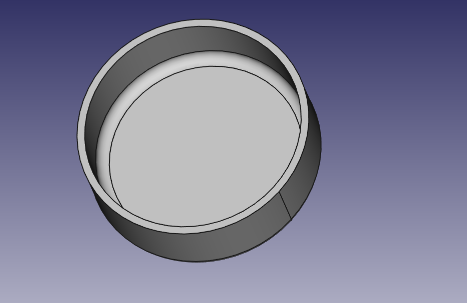
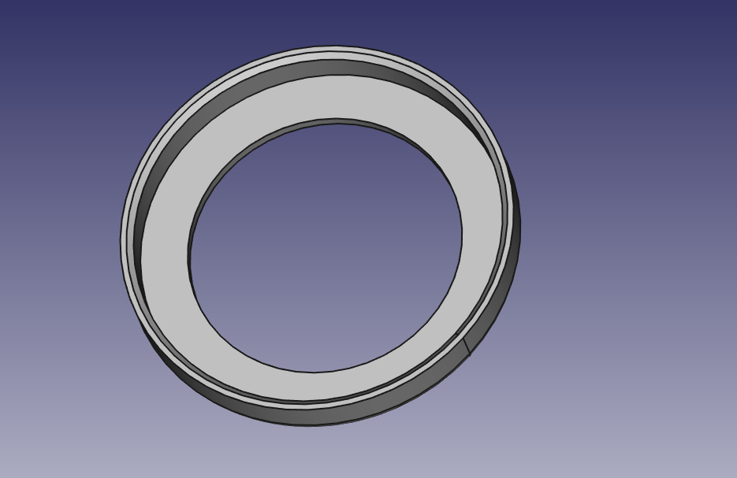

# Coffee Grounds Tray

A tray to keep coffee grounds to deodorize air.

## Requirements

- FreeCAD

## Tips

PLA works fine. I use PLA+ for strength.

`Layer Height` does not matter if you don't care about appearance.

Use higher `Infill Density`, such as 60%.

Enable `Connect Infill Lines`.

## Authors

- [Tomoyuki Sakurai](https://github.com/trombik)

## License

ISC. See {LICENSE](LICENSE) for details.
